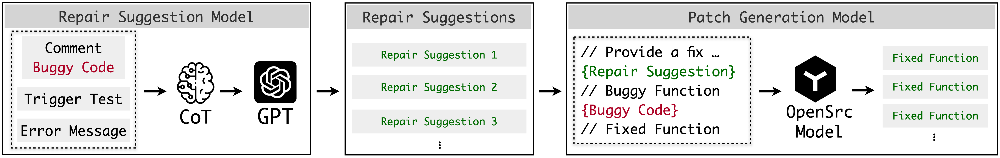
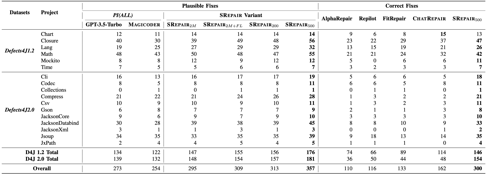

# ✅SRepair: Powerful LLM-based Program Repairer with $0.029/Fixed Bug

- *Fixes **300** out of 522 single-function bugs in the Defects4J dataset.*
- *Average cost of **$0.029** per correctly fixed bug.*
- ***NO** need for costly statement-level fault location.*
- *Fixes **multi-funciton bugs (32)** for the first time ever in business*


## About

<a href="https://arxiv.org/abs/2404.12833">
<a href="https://twitter.com/arisesustch">

<p align="left">
🛠️&nbsp;<a href="#%EF%B8%8F-srepair-framework">SRepair Framework</a>
|📚&nbsp;<a href="#-dataset">Dataset</a>
|📊&nbsp;<a href="#-evaluation">Evaluation</a>
|⚙️&nbsp;<a href="#%EF%B8%8F-environment-requirements">Environment requirements</a>
|🚀&nbsp;<a href="#-quick-start">Quick Start</a>
</p>

> [!IMPORTANT]
> Function-level repair is more dominant than the widely-adopted line-level or hunk-level repair techniques.

SRepair is the first function-level automated program repair technique, which can achieve remarkable repair performance by correctly fixing **300 single-function bugs**, largely surpassing the SOTA techniques, i.e., outperforming ChatRepair[1] by **85%** and Repilot[2] by **1.59×** in the Defects4J dataset, *without the need for the costly statement-level fault location information*. Specifically, the average cost per correctly fixed bug is **$0.029**, making SRepair an efficient LLM-based APR technique. Moreover, SRepair successfully fixes **32 multi-function bugs**, which is the first time achieved by any repairing technique ever to our best knowledge.

## 🛠️ SRepair Framework



As shown in figure above, SRepair first adopts a *repair suggestion mode*l which utilizes the learning power of LLM by comprehensively analyzing the *auxiliary repair-relevant information* (i.e., trigger tests, error messages, and comments) via the *Chain of Thought (CoT)* technique. Then it provides repair suggestions in natural language. Next, SRepair adopts a *patch generation model* which exhibits its code generation capabilities by generating the entire patched function following the repair suggestions. More specifically, we enable the *CoT* technique by prompting the LLM to first analyze the buggy function and project-specific information, then identify the root cause of the bug, and finally generate repair suggestions in natural language.

## 📚 Dataset 

- **Defects4J 1.2 & 2.0**: Defects4J dataset which is the most widely used APR dataset with a collection of a total of 835 real-world bugs extracted from open-source Java projects, comprising both buggy and fixed versions of the source code. We include all function-level bugs from Defects4J 1.2 and 2.0, thereby forming a dataset that comprises 522 single-function bugs and an additional 143 multi-function bugs, i.e., the bugs existing in multiple functions and requiring simultaneous edits on them for a fix.
- **QuixBugs Java & Python**: QuixBugs dataset is made up of 40 function-level buggy and fixed versions of classic programming problems in both Python and Java.

## 📊 Evaluation

### Metrics

- Plausible Patch: Passing all Defects4J trigger tests and relevant class-related tests.
- Correct Patch: Semantically equivalent to the developer's patch.

### Result



We find that SRepair outperforms all previous LLM-based APR techniques by at least **85%**. Specifically, we can observe that **68.4%** of single-function bugs (357) in Defects4J can be plausibly fixed, and even **57.5%** of bugs (300) can be correctly fixed by SRepair. Moreover, SRepair successfully fixes **32 multi-function bugs**, which is the first time achieved by any repairing technique ever to our best knowledge.Notably, SRepair successfully **fixes all bugs** in the QuixBugs dataset, indicating its superior capability for diverse programming languages.


## ⚙️ Environment requirements

**OS**: A Linux system with **[Docker](https://docs.docker.com/engine/install/)** support. (Optional: [NVIDIA Docker](https://github.com/NVIDIA/nvidia-docker) support)

**GPUs:** NVIDIA GPU(s) with >20G memory (For Magicoder 7B patch generation)

Specifically, you need to select the PyTorch installation according to your GPU and the version of CUDA you are using. For more details, please refer to https://pytorch.org/get-started/locally/.

### Docker install

We provide a Dockerfile for setting up the APR environment directly. First, build the LLM4APR image using the Dockerfile.

```docker build ./ --tag llm4apr```

Then create a container from the image and run:

```docker run -it --name llm4apr_ctn llm4apr```
or 
```docker run -it --gpus all --name llm4apr_ctn llm4apr ```
to enable gpus in docker. (See [NVIDIA Docker](https://github.com/NVIDIA/nvidia-docker))

### Download OpenSrc Models

You can utilize the scripts we provide to pre-download the models to your local environment, facilitating subsequent experiments. Specifically, please download the models individually as needed from the `pull_models.py` script. In SRepair, we prefer the Magicoder[3] model as patch generation model.

| Model                 | Checkpoint                                                   | Size | HumanEval (+)       | MBPP (+)            | License                                                      |
| --------------------- | ------------------------------------------------------------ | ---- | ------------------- | ------------------- | ------------------------------------------------------------ |
| Magicoder-CL-7B       | 🤗 [HF Link](https://huggingface.co/ise-uiuc/Magicoder-CL-7B) | 7B   | 60.4 (55.5)         | 64.2 (52.6)         | [Llama2](https://ai.meta.com/llama/license/)                 |
| Magicoder-*S*-CL-7B   | 🤗 [HF Link](https://huggingface.co/ise-uiuc/Magicoder-S-CL-7B) | 7B   | 70.7 (66.5)         | 68.4 (56.6)         | [Llama2](https://ai.meta.com/llama/license/)                 |
| Magicoder-DS-6.7B     | 🤗 [HF Link](https://huggingface.co/ise-uiuc/Magicoder-DS-6.7B) | 6.7B | 66.5 (60.4)         | 75.4 (61.9)         | [DeepSeek](https://github.com/deepseek-ai/DeepSeek-Coder/blob/main/LICENSE-MODEL) |
| Magicoder-*S*-DS-6.7B | 🤗 [HF Link](https://huggingface.co/ise-uiuc/Magicoder-S-DS-6.7B) | 6.7B | **76.8** (**70.7**) | **75.7** (**64.4**) | [DeepSeek](https://github.com/deepseek-ai/DeepSeek-Coder/blob/main/LICENSE-MODEL) |

## 🚀 Quick Start

### SRepair: Repair Suggestion📥

To generate suggestions for single function bugs, execute `./SRepair/src/sf_gen_solution.py` as follows:

```java
python3 ./SRepair/src/sf_gen_solution.py -d ./SRepair/dataset/defects4j-sf.json -o ./math2_solution.json -s 2 -bug Math-2
```

It will query chatgpt model twice, generating multiple distinct bug-fixing suggestions for bug Math-2. Its raw output will be stored in the file `./math2_solution.json`, and the extracted suggestions will be stored in `./math2_solution_extracted.json`. Below is the detailed parameter setting. 

<details><summary>parameter setting</summary>
<div>


  Below, we will provide a detailed explanation of the parameters for this method:

  - `d`: Specifies the path to the dataset. This argument is required.
  - `o`: Specifies the path to the raw output. This argument is required.
  - `eo`: Specified the path to extracted suggestions. This argument is optional.
  - `s`: Specifies the sample size. This argument is optional, with a default value of 1.
  - `bug`: Specifies the bug to generate suggestion for. This argument is optional.

  These parameters are used to configure and control the behavior of the program when generating suggestions.
</div>
</details>

To generate suggestions for multi-function bugs, execute `./SRepair/src/mf_gen_solution.py` as follows:

```java
python3 ./SRepair/src/mf_gen_solution.py -d ./SRepair/dataset/defects4j-mf.json -o ./chart19_solution.json -s 2 -bug Chart-19
```

Its usage is similar to `sf_gen_solution.py`, except that it will only generate one distinct suggestion per query, so the above command will only generate two distinct suggestions for bug Chart-19.

### SRepair: Patch Generation📤

To generate patches for single function bugs, execute `./SRepair/src/sf_gen_patch.py` as follows:

```java
python3 ./SRepair/src/sf_gen_patch.py -d ./SRepair/dataset/defects4j-sf.json -s ./math2_solution_extracted.json -o ./math2_patches.json -bug Math-2
```

It will generate patches by open source model for bug Math-2, with its sample size decided by the number of provided suggestions (5 patches for each suggestion). Below is the detailed parameter setting. 

<details><summary>parameter setting</summary>
<div>


Below, we will provide a detailed explanation of the parameters for this method:

- `d`: Specifies the path to the dataset. This argument is required.
- `s`: Specifies the path to the suggestions. This argument is required.
- `o`: Specifies the path to the generated patch. This argument is required.

- `bug`: Specifies the bug to generate suggestion for. This argument is optional.
  </div>
  </details>

To generate patches for multi-function bugs, execute `./SRepair/src/mf_gen_patch.py` as follows:

```java
python3 ./SRepair/src/mf_gen_patch.py -d ./SRepair/dataset/defects4j-mf.json -s ./chart19_solution_extracted.json -o ./chart19_patches.json -bug Chart-19
```

Its usage is similar to `sf_gen_patch.py`.

### SRepair: Patch Validation📇

For single function bugs, the validation process is identical to that in study part, since the format of generated patches is not changed.

```java
python3 ./SRepair/src/sf_val_d4j.py -i ./math2_patches.json -o ./math2_patches_val -d ./SRepair/dataset/defects4j-sf.json
```

For multi-function bugs, they can be validated by executing `./SRepair/src/mf_val_d4j.py` as follows:

```java
python3 ./SRepair/src/mf_val_d4j.py -i ./chart19_patches.json -o ./chart19_patches_val -d ./SRepair/dataset/defects4j-mf.json
```

And its parameter setting is still the same as the setting of single function validation.

## Reference

> [1] Xia, Chunqiu Steven, and Lingming Zhang. "Keep the Conversation Going: Fixing 162 out of 337 bugs for $0.42 each using ChatGPT." *arXiv preprint arXiv:2304.00385* (2023).
>
> [2] Wei, Yuxiang, Chunqiu Steven Xia, and Lingming Zhang. "Copiloting the copilots: Fusing large language models with completion engines for automated program repair." *Proceedings of the 31st ACM Joint European Software Engineering Conference and Symposium on the Foundations of Software Engineering*. 2023.
>
> [3] Wei, Yuxiang, et al. "Magicoder: Source code is all you need." *arXiv preprint arXiv:2312.02120* (2023).
